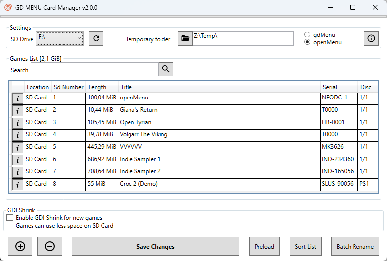
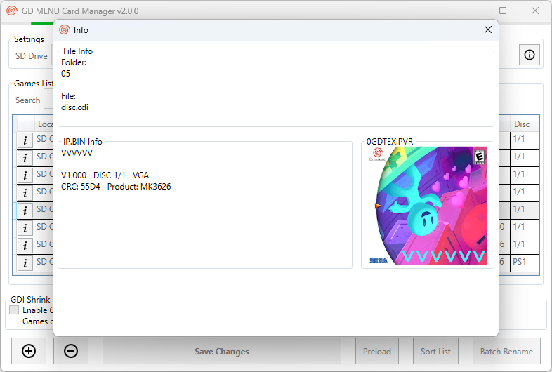
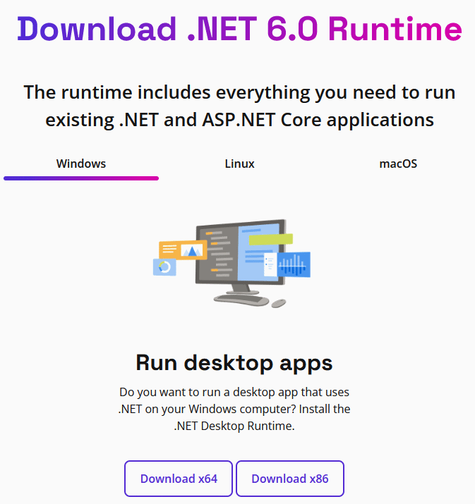

# GDMENU Organizer

Index your local Dreamcast GD ROM library, organize titles into **Cards**, and copy a Card to an SD card for use with GDEMU / GDmenu / openMenu.

GDEMU expects a specific folder layout on the SD card. Getting that wrong slows boots or can prevent them entirely. GDMENU Organizer builds that layout correctly so your console boots quickly.

Forked from [GDMENU Card Manager](https://github.com/sonik-br/GDMENUCardManager) by Sonik.




## Vision

* **Local ROM index** — scan and catalog GD ROM files stored on your machine
* **Cards** — user-defined subsets of that library (playlists / SD layouts)
* **Load & write** — load a Card into the app and copy it to an SD card in GDEMU-friendly order

Current releases still include the original SD card manager workflow. The library index and multi-Card organization features are the roadmap for this fork.

## Features

* Multi platform: Windows / Linux / macOS
* Supports both GDmenu and openMenu
* Supports GDI, CDI, MDS and CCD files; also archives (zip / rar / 7z)
* Add / delete / rename items
* Sort alphabetically or manually (drag and drop)
* Automatically rename from folder name, file name, or internal name (IP.BIN)
* Show cover image (`0GDTEX.PVR`)
* CodeBreaker image detection when applicable
* Writes `name.txt` per folder for compatibility with other managers
* Menu built as GDI (works on consoles that cannot boot MIL-CD)
* GDI shrinking (removes dummy data to reduce size)

### GDI Shrinking

Shrinking can break some titles. A blacklist of known-problematic games is used by default so those games are left unshrunk.

### openMenu

openMenu can show custom icons, box art, and text per title, but needs extra DAT files.

Place openMenu DAT files under this app's `tools\openMenu\menu_data` folder.  
Get them from mrneo240's repos: [imagedb](https://github.com/mrneo240/openMenu_imagedb) and [metadb](https://github.com/mrneo240/openMenu_metadb).

### Windows: .NET 6 Desktop Runtime

Install the [.NET 6 Desktop Runtime](https://dotnet.microsoft.com/download/dotnet/6.0/runtime) for your system.



### Limitations

* Linux: drag-and-drop is not available
* macOS: if the app will not run, see upstream issue [#4](https://github.com/sonik-br/GDMENUCardManager/issues/4) for a workaround

## Building

### Linux x64 (CLI)

1. Install the .NET 6 SDK ([Install .NET on Linux](https://learn.microsoft.com/en-us/dotnet/core/install/linux))
2. Clone this repository and `cd` into `src`
3. Publish:

```bash
# Framework-dependent
dotnet publish GDMENUOrganizer.AvaloniaUI/GDMENUOrganizer.AvaloniaUI.csproj -c Release

# Single-file, self-contained (bundles the runtime)
dotnet publish GDMENUOrganizer.AvaloniaUI/GDMENUOrganizer.AvaloniaUI.csproj -c Release \
  --self-contained true -r linux-x64 \
  -p:PublishSingleFile=true -p:IncludeNativeLibrariesForSelfExtract=true
```

4. Run the binary from the publish output, for example:

```bash
./GDMENUOrganizer.AvaloniaUI/bin/Release/net6.0/linux-x64/publish/GDMENUOrganizer
```

### macOS

1. Install [.NET Runtime 6.0](https://dotnet.microsoft.com/download/dotnet/6.0/runtime) and the SDK (`brew install dotnet`)
2. Build and run:

```bash
cd src/
dotnet publish GDMENUOrganizer.AvaloniaUI/GDMENUOrganizer.AvaloniaUI.csproj -c Release
cd GDMENUOrganizer.AvaloniaUI/bin/Release/net6.0/publish/
./GDMENUOrganizer
```

## Credits

Based on **GDMENU Card Manager** by Sonik.

This software also relies on third-party tools:

GDmenu by neuroacid  
[openMenu](https://github.com/mrneo240/openmenu/),
[GdiTools](https://sourceforge.net/projects/dcisotools/),
[GdiBuilder](https://github.com/Sappharad/GDIbuilder/),
[Aaru](https://github.com/aaru-dps/Aaru/),
[PuyoTools](https://github.com/nickworonekin/puyotools/),
[7-zip](https://www.7-zip.org/),
[SevenZipSharp](https://github.com/squid-box/SevenZipSharp/)

Special thanks to megavolt85 and everyone in the Dreamcast scene.
